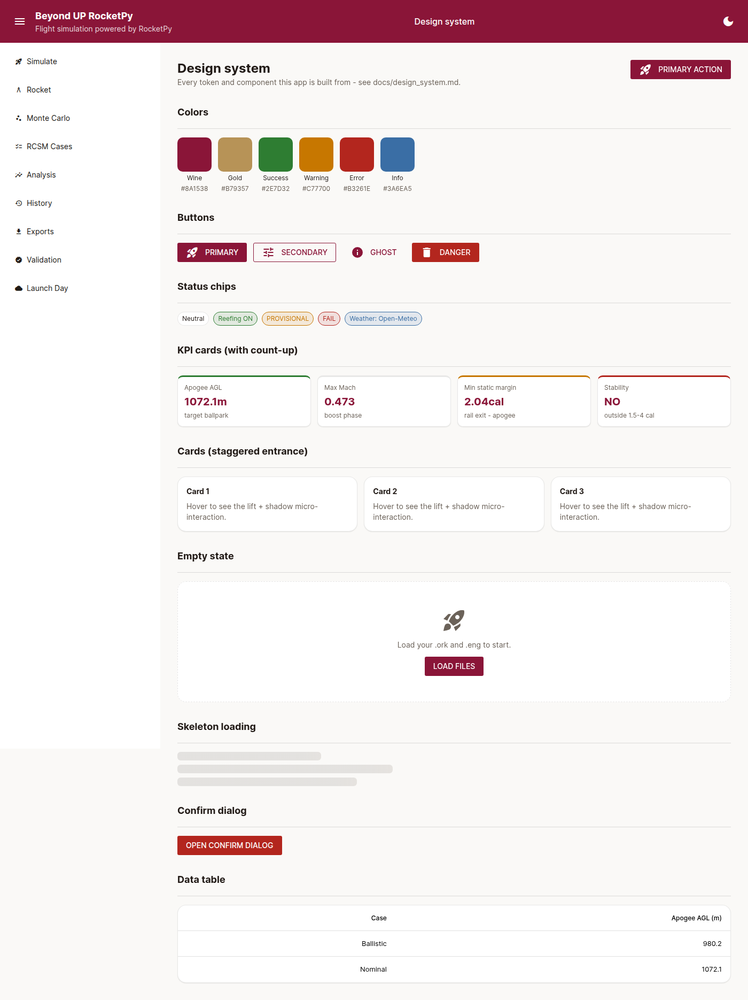
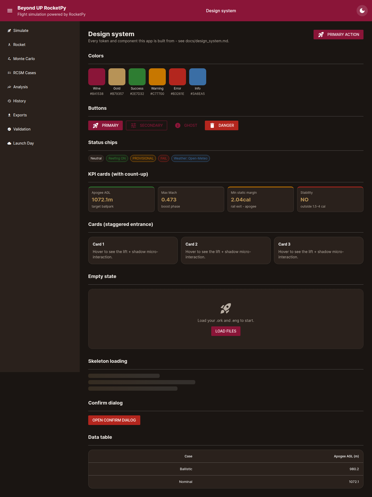

# Beyond UP RocketPy - design system

Every page in this app is built from the tokens and components documented
here (`bup_rocketpy/gui/theme.py` + `bup_rocketpy/gui/components.py`).
Nothing outside those two files should hardcode a color, spacing value,
radius, shadow, or motion timing - that's what makes the planned rebrand
a one-file change instead of a search-and-replace across every page.

See it live at `/design-system` (not in the sidebar nav - it's a
reference page for whoever touches the UI next, not a Diego-facing
feature). Screenshot, light and dark:

## Tokens (`theme.py`)

All exposed as CSS custom properties (`var(--bup-*)`) so components never
hardcode a value, plus as plain Python constants for matplotlib plots and
anywhere Python needs the raw hex.

| Token | Light | Dark | Use |
|---|---|---|---|
| `--bup-wine` | `#8A1538` | same | Primary brand color - header, primary buttons, active KPI values |
| `--bup-gold` | `#B79357` | same | Accent - active nav indicator, secondary buttons, dark-mode KPI values |
| `--bup-success` | `#2E7D32` | same | Passing/OK status |
| `--bup-warning` | `#C77700` | same | PROVISIONAL/needs-attention status |
| `--bup-error` | `#B3261E` | same | Failing/destructive status, danger buttons |
| `--bup-info` | `#3A6EA5` | same | Informational chips (weather source, etc.) |
| `--bup-bg` | `#FAF9F7` | `#1A1512` | Page background |
| `--bup-surface` | `#FFFFFF` | `#2A211C` | Card/sidebar/dialog background |
| `--bup-text` | `#211A16` | `#F2EEE9` | Body text |
| `--bup-muted` | `#6B6259` | `#B8AEA3` | Secondary/caption text (labels, captions) |
| `--bup-border` | `rgba(33,26,22,0.10)` | `rgba(242,238,233,0.12)` | Card/divider borders |

Contrast (WCAG AA, checked against the pairings actually used - see
`theme.py`'s own `CONTRAST_NOTES`): wine/white text pairs pass at ~8.6:1;
gold is reserved for large text (>=24px) and non-text UI accents, where
the 3:1 threshold applies instead of 4.5:1; muted text passes at
4.6:1 (light) / 7.4:1 (dark).

**Type scale**: one font, Inter (vendored locally via `@fontsource/inter`,
4 weights - 400/500/600/700 - no CDN, `static/fonts/`). Size scale is
Tailwind/Quasar's existing utility classes already used everywhere
(`text-xs` through `text-2xl` + `font-medium`/`font-bold`) - not
reinvented, just applied consistently through the components below
instead of ad hoc per page.

**Spacing/radii/shadows**: Tailwind's existing spacing utilities
(`p-2`/`gap-4`/etc.) for layout; `--bup-radius-sm/md/lg` (6/10/16px) and
`--bup-shadow-sm/md/lg` for cards, both as CSS custom properties so a
component only ever says `border-radius: var(--bup-radius-lg)`.

**Motion**: `--bup-duration-fast/base/slow` (120/200/250ms) and
`--bup-ease` (`cubic-bezier(0.4, 0, 0.2, 1)`, Material's "standard"
curve) - see the Motion section below for how they're used.

## Components (`components.py`)

| Component | Function | Notes |
|---|---|---|
| Page header | `page_header(title, description, action_label=, action_icon=, on_action=)` | Title + one-line description + a single primary action, identical shape on every page |
| Card | `card(interactive=, stagger_index=)` (context manager) | `interactive=True` adds a hover lift; `stagger_index=i` adds the staggered entrance |
| KPI card | `kpi_card(label, value, unit, caption, status=, countup_target=, decimals=, stagger_index=)` | Colored top border for status (`good`/`warn`/`bad`/`neutral`/`info`); `countup_target` animates the number in |
| Status chip | `status_chip(text, kind=)` | `neutral`/`success`/`warning`/`error`/`info` - used for Reefing ON, PROVISIONAL, weather source, etc. |
| Button | `button(label, kind=, icon=, on_click=)` | `primary`/`secondary`/`ghost`/`danger` - thin wrapper over `ui.button`, native focus/ripple untouched |
| Empty state | `empty_state(icon, text, action_label=, on_action=)` | Icon + one sentence + action, used on every page's "nothing loaded yet" state |
| Skeleton | `skeleton(height=, width=)` | Shimmering placeholder bar for a loading section |
| Dropzone | `dropzone(label, on_upload, accept=)` | Styled wrapper over `ui.upload` (Quasar's uploader already supports drag-and-drop) |
| Confirm dialog | `confirm_dialog(message, confirm_label=, danger=)` | Returns `(dialog, confirm_button)` - caller wires the actual action and calls `dialog.open()` |
| Data table | `data_table(columns, rows)` | Thin themed wrapper over `ui.table` |
| Toasts | `ui.notify(..., type=)` (NiceGUI/Quasar built-in) | Deliberately NOT reimplemented - Quasar's own Notify plugin already matches the palette via `ui.colors()` in `theme.apply()` |
| Tabs | `ui.tabs()`/`ui.tab_panels()` (NiceGUI built-in) | Same reasoning as toasts - themed via CSS, not rebuilt |

`components.finish_motion()`: call after inserting cards/KPI values
**outside** the initial page render (a button click handler, a
background-task completion callback) - `motion.js`'s `DOMContentLoaded`
listener only covers what's on the page at load time.

## Motion (Step 2)

- **Page entrance**: `.bup-page-enter` (the content column every
  `layout()` call wraps) fades + slides in over 250ms on every
  navigation.
- **Card stagger**: `.bup-stagger` + `--bup-i: <index>` (set by
  `card(stagger_index=i)`/`kpi_card(..., stagger_index=i)`) delays each
  card's entrance by `i * 40ms`, so a grid of cards cascades in instead
  of popping all at once.
- **KPI count-up**: `data-bup-countup`/`data-bup-target` (set by
  `kpi_card(..., countup_target=...)`), animated by `static/motion.js`'s
  `BUP.countUp()` with an ease-out-cubic curve over 600ms.
- **Hover/press micro-interactions**: cards lift 1px + gain a stronger
  shadow on hover (`.bup-card-interactive`), buttons scale down slightly
  on press (`.bup-btn-primary:active`).
- **Sidebar collapse**: the hamburger button in the header calls
  Quasar's own `QDrawer.toggle()`, which already animates smoothly -
  not reimplemented.
- **`prefers-reduced-motion`**: every keyframe animation (page enter,
  stagger, skeleton shimmer) is declared *inside*
  `@media (prefers-reduced-motion: no-preference)` - with that
  preference set, elements simply render at their final state
  immediately, no motion at all. `motion.js`'s count-up checks the same
  media query in JS and jumps straight to the final number.
- **Performance**: everything above is a CSS transform/opacity animation
  or a `requestAnimationFrame` loop over plain numbers - no layout
  thrashing, nothing that would visibly slow the app down on a normal
  laptop.

## A real bug this design system caught

Building the gallery page surfaced a genuine rendering bug, not just a
style preference: a global `* { font-family: 'Inter' }` rule was
silently overriding every sidebar/button icon's own font, because
NiceGUI/Quasar ship their base CSS inside a named `@layer base`
(`@import url(...) layer(base)`), and **unlayered CSS always wins over
layered CSS regardless of specificity** - a real CSS cascade-layers
gotcha. Icons rendered as literal text ("rocket_launch") instead of
glyphs. Fixed in `theme.py` with an explicit
`.material-icons, .q-icon { font-family: "Material Icons" !important; }`
restore rule, and locked in with `tests/test_design_system_e2e.py`
(checks `document.fonts.check('24px "Material Icons"')` after
`document.fonts.ready` - not `innerText`, which can't tell the
difference since Material Icons uses font ligatures).
